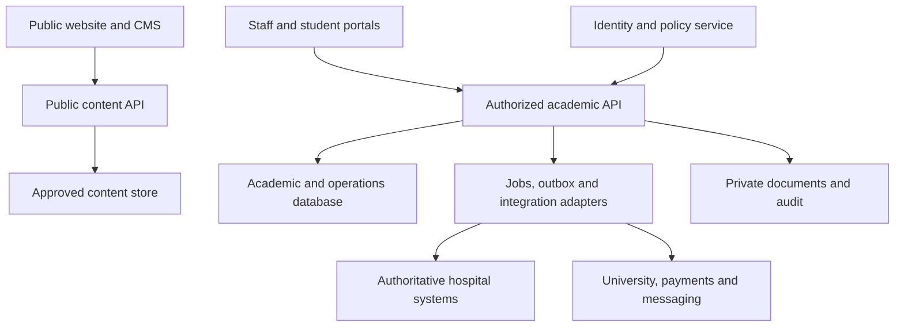

# Medical College Management Platform
# Production Product Requirements Document (PRD)

| Document control | Value |
|---|---|
| Version | 1.0 |
| Prepared | 28 September 2026 |
| Status | Implementation planning baseline — institutional validation pending |
| Audience | Product owner, college leadership, designers, developers, QA, hospital IT, security and operations |
| Product | Public institutional website + academic ERP + teaching-hospital integration + research and administration |
| Context | Indian medical college with MBBS, internship and MD/MS programmes; one institution with multiple campuses/affiliated hospitals |
| Language | Technical requirements in English; stakeholder guidance in Bengali |
| Source baseline | medical-college-management-production-roadmap-bn.md, reviewed in this conversation |
| Approvers | College sponsor, registrar, academic lead, medical superintendent, finance lead and IT/security lead — names pending |

**ব্যবহার:** এই PRD design, backlog, API contract, development এবং UAT-এর baseline। “Production” বলতে এখানে production system-এর requirements বোঝানো হয়েছে; software ইতিমধ্যে তৈরি বা certified হয়েছে এমন দাবি নয়। Unknown institutional policies are listed as decisions with owners and release gates. Timelines and capacity figures are planning assumptions, not confirmed institutional facts.

## Contents

1. Product purpose and measurable outcomes
2. Assumptions, release boundaries and exclusions
3. Users, permissions and ownership
4. Product surfaces and experience requirements
5. Functional requirements and acceptance criteria
6. Workflow states and business rules
7. Data requirements and architecture boundaries
8. Integrations and API behaviour
9. Security, privacy, quality and operational requirements
10. Delivery, migration, verification and launch
11. Decisions, risks and references

## 1. Product purpose

Provide a connected platform for a medical college to publish trustworthy institutional information, manage students from admission to graduation, deliver competency-based teaching, verify clinical training, administer research and operate institutional services. Teaching-hospital information must flow through authorized clinical systems with a clearly owned source of truth.

### 1.1 Problems to solve

- Student, faculty, attendance, assessment and fee information is fragmented across spreadsheets and software.
- Supervisors cannot reliably connect teaching activities and clinical exposure to competency evidence.
- Administrators repeatedly collect the same evidence for reports and inspections.
- Patients' clinical records can become exposed when copied into academic or research workflows.
- College websites become stale because content has no accountable owner or approval workflow.
- Payment, biometric and hospital integrations fail without visible reconciliation or resolution ownership.

### 1.2 Proposed success measures

Measure a four-week pre-pilot baseline. Product owner confirms targets before Release 1 (R1).

| Metric | Definition and proposed target | Owner |
|---|---|---|
| Student record coverage | 100% of pilot students have a reconciled ID, programme, batch and admission record | Registrar |
| Attendance completeness | At least 95% of scheduled, conducted pilot sessions finalized within 48 hours | Academic lead |
| Supervisor turnaround | At least 90% of submitted pilot logbook entries reviewed within five working days | HOD |
| Staff adoption | At least 85% of assigned pilot faculty complete one relevant weekly action over four consecutive weeks | Product owner |
| Payment reconciliation | Every gateway transaction classified as matched, pending or exception by next working day; zero unexplained variance before finance closure | Finance |
| Reporting effort | Reduce staff time to prepare the agreed pilot evidence pack by 50% against baseline | Quality office |
| Content freshness | 100% of mandatory disclosure pages have owner, review date and current approved version | CMS lead |
| Data isolation | Zero unauthorized cross-role or cross-institution disclosures in release security tests | Security |

Metrics are operational goals. They are not permission to alter attendance, clinical events or academic outcomes to meet targets.

## 2. Assumptions and release scope

### 2.1 Planning assumptions

| ID | Assumption | If false |
|---|---|---|
| AS-01 | First customer is one Indian medical college with one or more campuses and affiliated hospitals | Re-scope regulation, tenancy and organization structure |
| AS-02 | Admission is based on approved external counselling/allotment decisions | Document the actual lawful admission workflow before configuration |
| AS-03 | An existing HMIS remains authoritative for live patient care in initial releases | Activate the separate clinical-build programme; do not use academic software as an improvised HMIS |
| AS-04 | English and Bengali are initial website languages; clinical language needs are to be confirmed | Add localization requirements and content owners |
| AS-05 | Existing university systems remain authoritative for university registration and final university awards | Agree explicit authority for each assessment/result type |
| AS-06 | Initial web portals are responsive; a student/faculty PWA is sufficient | Native applications require separate distribution and device scope |
| AS-07 | Baseline load is 5,000 students, 1,000 staff and 500 concurrent authenticated users | Recalculate performance and hosting envelope |

### 2.2 Releases

**Priority:** P0 = mandatory for the specified release; P1 = expected in that release unless formally deferred; P2 = optional, separately estimated. A P0 requirement in R3 does not block R1.

| Release | Scope | Exit outcome |
|---|---|---|
| R0: Foundation | Identity, roles, organization, audit, file service, environments, design system and configuration | Secure platform supports complete vertical slices |
| R1: Academic production pilot | Public website/CMS; admissions; SIS; curriculum; timetable; attendance; internal assessments; e-logbook; student fees; basic notices/helpdesk; evidence export | One MBBS batch and two departments complete validated workflows |
| R2: Clinical education and training | Existing HMIS bridge; supervised teaching cases; internship; PG; enhanced LMS; research/IEC basics; ABDM integration where applicable through responsible HMIS vendor | Verified training and research workflows with clinical boundaries |
| R3: Institutional expansion | Research grants, facilities, HR, procurement, library, hostel/mess, transport, alumni, advanced analytics | Departmental operations live across institution |
| C: Optional clinical build | New HMIS/EMR, LIS/pharmacy/OT/blood-bank integrations, patient portal | Separate clinical specification, clinical assurance and staged go-live |
| R4: Optional automation | Approved-document assistant, OCR suggestions, analytics assistance | Measured accuracy, permission checks and human approval |

### 2.3 Explicit exclusions from R1

Full hospital EMR replacement; automated diagnosis/prescribing; automatic admissions or grade decisions; external counselling allocation; university authority replacement; autonomous regulatory submissions; payroll/tax engine; full clinical-trial EDC; native mobile apps; commercial SaaS subscriptions for unrelated institutions.

Hospital, research and administrative features below define the overall product scope. Complex clinical modules require workflow-specific clinical specifications before implementation, not merely this PRD.

## 3. Users, access and accountability

Every authorization combines identity, action, institution, campus, department and record relationship. UI hiding is not authorization. All APIs and file downloads enforce the same policy.

| Role | Allowed actions | Important boundary |
|---|---|---|
| Platform operator | Deployment, monitoring, tenant configuration, support diagnostics | No default access to student documents or clinical charts |
| College administrator | Organization, accounts and delegated configuration | Cannot self-grant clinical access or change published grades |
| Dean/principal | Institutional academic reports, approved decisions | Patient detail only under a separate authorized clinical role |
| Registrar/admissions | Allotment verification, enrolment, documents, official student records | No academic mark editing or clinical access |
| HOD/academic coordinator | Department planning, faculty assignment, moderation and escalation | Scoped department/programme access |
| Faculty/supervisor | Assigned sessions, attendance, assessment and logbook review | Cannot approve own learner submissions or edit unrelated marks |
| Student/intern/PG | Own records, assignments, logbook, applications and permitted learning resources | No direct full-chart access through academic role |
| Finance | Invoices, receipts, refunds, settlements and financial reports | Clinical notes and restricted academic/grievance data excluded |
| Research PI | Assigned project, protocol and grant workflows | Study participant data governed separately |
| IEC reviewer/secretariat | Assigned review, meeting decisions, protocol versions | Recusal and conflict-of-interest restrictions |
| Medical superintendent/clinical team | HMIS functions according to clinical role | Academic privileges are separate |
| HR/librarian/warden | Their operational module and minimum required profile fields | No full student/faculty dossier by default |
| Patient | Own verified appointments, documents and authorized proxies | Patient identity verification required |
| Auditor | Time-bounded read-only approved evidence | Exports audited; no unrestricted record browsing |
| Guardian | Optional, consented and institution-approved limited student information | Adult student data is not automatically disclosed |

**Separation of duties:** refund maker cannot be sole approver; final grade publisher is independent of marks entry; sensitive role grants require authorized approval; content author/publisher separation is configurable; emergency clinical access is exceptional and reviewed.

## 4. Product surfaces and UX

### 4.1 Public website sitemap

Home; About/Leadership/Governance; Departments; Faculty and Experts; Programmes and Admissions; Academic Calendar; Teaching Hospital; Research/Projects/Publications; Labs and Facilities; News/Events; Notices/Downloads; Tenders; Careers; Alumni; Mandatory Disclosures; Grievance/Anti-ragging Information; Contact; Search; Privacy/Accessibility; Portal Login.

Each department has overview, leadership, faculty, teaching programmes, facilities, research, contact and owned news. Public patient-facing services link only to approved clinical flows.

### 4.2 Authenticated navigation

| Portal | Main navigation |
|---|---|
| Student | Today, Timetable, Attendance, Learning, Assessments, Logbook, Rotations, Fees, Documents, Requests, Notifications |
| Faculty | Today, Sessions, Attendance, Assessments, Review Queue, Students, Research, Resources |
| Academic admin | Admissions, Students, Programmes, Curriculum, Scheduling, Exams, Training, Reports |
| Institutional admin | People, Finance, Research, Facilities, Campus Services, CMS, Evidence, Support, Settings |
| Hospital bridge | Integration Status, Approved Teaching Cases, Exposure Reconciliation, Clinical Reporting |

### 4.3 Experience requirements

- Professional institutional design with restrained colour, strong typography, accessible contrast and actual licensed campus/clinical imagery. Final brand tokens follow college approval.
- Public site is content-led; operational portals prioritize tasks, tables, review queues and dates. Avoid decorative dashboards without decisions.
- Student mobile view supports quick attendance review, session schedule, upload and logbook entry with reachable primary actions. Desktop supports bulk academic workflows.
- Every screen defines loading, empty, error, validation, access-denied, stale-data and success states; preserve unsaved work and warn on destructive navigation.
- Dates display in institution timezone; APIs store UTC timestamps. Academic dates are date-only where appropriate. Money uses integer minor units with currency.
- Accessible keyboard and screen-reader flows; target WCAG 2.2 AA as a design/QA requirement. Language toggle preserves page and does not show unapproved translations.
- Tables support scoped search, pagination, filters, export permissions and saved views. Bulk actions show count, scope and confirmation where irreversible.

## 5. Functional requirements

Each requirement is independently traceable to a test. All destructive changes require permissions and audit. Acceptance criteria apply within authorized scope.

### 5.1 Foundation and configuration

| ID / release / priority | Requirement | Acceptance criteria |
|---|---|---|
| FND-01 / R0 / P0 | Organization hierarchy and academic masters | Admin creates campuses, hospitals, departments, programmes, batches and terms; duplicate keys rejected; referenced masters can be retired but not destructively deleted |
| FND-02 / R0 / P0 | SSO/local identity and role scopes | Login, MFA, recovery and revocation work; forbidden resource request returns no protected data; permission changes invalidate authorization within 60 seconds |
| FND-03 / R0 / P0 | Versioned policy configuration | Effective-dated policies require owner and approval; published results retain original policy version; draft policy cannot affect live calculations |
| FND-04 / R0 / P0 | Auditable actions | Sensitive read/export/write records include actor, action, entity, time, correlation ID and reason where needed; access is restricted and events cannot be edited through product APIs |
| FND-05 / R0 / P0 | Document service | File remains quarantined until scan passes; signed download checks access; rejected uploads show reason; version and checksum retained |
| FND-06 / R0 / P0 | Common approval engine | Delegation has expiry and scope; escalation reminders do not imply approval; self-approval blocked for configured sensitive workflows |
| FND-07 / R1 / P0 | Feature configuration | Disabled modules cannot be called through APIs; enabling a clinical module requires its release prerequisites |

### 5.2 Website and CMS

| ID / release / priority | Requirement | Acceptance criteria |
|---|---|---|
| CMS-01 / R1 / P0 | Structured pages and reusable content | Editor creates all sitemap content types without code; draft preview requires permission; only approved version is publicly searchable |
| CMS-02 / R1 / P0 | Publishing and review lifecycle | Draft → review → approved → scheduled/published → archived; owner and review date required; restoring prior content creates a new revision |
| CMS-03 / R1 / P0 | Directories and disclosures | Faculty, department, programme and disclosure pages show approved public fields; private phone, identity documents and internal notes never serialize publicly |
| CMS-04 / R1 / P1 | Search and discovery | Public search filters news/people/programmes/research; unpublished items excluded; sitemap, canonical URL and redirects validated |
| CMS-05 / R1 / P0 | Forms and notices | Enquiry generates ticket and acknowledgement; rate limits and accessible abuse controls apply; no sensitive attachment is sent directly in public email |
| CMS-06 / R1 / P1 | Multilingual content | Translation is reviewed independently; missing version uses explicit configured fallback; all links and download labels remain understandable |

### 5.3 Admissions and SIS

| ID / release / priority | Requirement | Acceptance criteria |
|---|---|---|
| ADM-01 / R1 / P0 | Allotment import and application | CSV/API input validates required fields and source batch; duplicate external allotment cannot create duplicate application; rejected rows downloadable |
| ADM-02 / R1 / P0 | Document verification | Checklist depends on programme/category/policy; verifier records pass, discrepancy or rejection with reason; resubmission preserves earlier version |
| ADM-03 / R1 / P0 | Seat and quota controls | Confirming two candidates for the last seat under concurrent requests yields one success; reserved capacity rules are effective-dated and approved |
| ADM-04 / R1 / P0 | Admission confirmation | Approved eligibility, allotment and required payment/authorized waiver must exist; retries issue one student ID and one admission letter |
| ADM-05 / R1 / P1 | Withdrawal, transfer and document custody | Approved withdrawal updates seat state per policy and opens refund workflow; original-document receipt and return capture custodian, date and acknowledgement |
| SIS-01 / R1 / P0 | Student master and lifecycle | One stable institutional ID follows programme/batch changes; historical enrolments retained; ID merge requires review and audit |
| SIS-02 / R1 / P0 | Student portal and requests | Student sees only own attendance, published results, fees and logbook; certificate/leave requests track status and rejection reason |
| SIS-03 / R1 / P1 | Academic documents | Approved transcript/certificate has unique verification reference; public verifier exposes minimum fields and revoked status; reissue is versioned |
| SIS-04 / R2 / P1 | Mentoring and wellbeing | Assigned mentor records restricted guidance and referrals; wellbeing/disciplinary notes excluded from routine teaching exports |

### 5.4 Curriculum, timetable and attendance

| ID / release / priority | Requirement | Acceptance criteria |
|---|---|---|
| ACA-01 / R1 / P0 | Versioned curriculum catalogue | Import competencies with code, source, programme, phase and effective version; duplicate code within version rejected; existing cohorts retain assigned version |
| ACA-02 / R1 / P0 | Teaching plan | Session links subject, competencies, activity, cohort, faculty, time and location; missing required mappings block publication |
| ACA-03 / R1 / P0 | Timetable constraints | Faculty, room, cohort and configured clinical capacity clashes block publication; documented authorized exceptions are visible and audited |
| ACA-04 / R1 / P0 | Attendance capture | Assigned faculty marks present/absent/approved categories only for conducted session; duplicate submit has no duplicate rows; finalized register is locked |
| ACA-05 / R1 / P0 | Corrections and shortage | Correction requires reason and approval; recomputation records policy version; cancelled sessions are excluded from denominator; alerts explain contributing sessions |
| ACA-06 / R1 / P0 | Eligibility calculation | Theory/practical/posting categories calculated independently using approved policy; missing/unfinalized data flags provisional status instead of silently marking eligible |
| ACA-07 / R2 / P1 | Biometric imports | Source event ID deduplicates; unmapped identity enters exception queue; device events do not become academic attendance without defined matching rules |
| ACA-08 / R2 / P1 | Disconnected capture | Limited faculty attendance drafts may queue on approved devices with expiry; conflicting server edits require review; offline draft never counts until confirmed server-side |

### 5.5 Assessments, LMS and e-logbooks

| ID / release / priority | Requirement | Acceptance criteria |
|---|---|---|
| EXM-01 / R1 / P0 | Assessment plans and rubrics | Test defines scope, competency mapping, components, maximum marks, examiner and moderation rules; published rubric version remains attached to marks |
| EXM-02 / R1 / P0 | Marks entry and moderation | Range/type checks enforced; absent, withheld and not assessed differ from zero; submitted marks lock; correction retains old/new value and reason |
| EXM-03 / R1 / P0 | Result approval and publication | Authorized independent publisher signs snapshot; students see only published records; revocation removes visibility and notifies affected users with approved message |
| EXM-04 / R2 / P1 | OSCE/OSPE and practical exams | Station capacity/time/examiner conflicts detected; rubric scores roll up reproducibly; incomplete stations cannot silently become zero |
| EXM-05 / R1 / P1 | Appeals and revaluation | Deadline and policy version stored; restricted reviewer examines case; outcome generates approved amended result if necessary |
| LMS-01 / R1 / P1 | Resources and assignments | Faculty assigns material to authorized cohorts; submission deadline, extension and version are recorded; inaccessible resources never appear in search |
| LMS-02 / R2 / P1 | Quizzes/question bank and feedback | Questions have scoped authoring access; attempts and rubric versions retained; formative quiz scores cannot overwrite official assessment records |
| LOG-01 / R1 / P0 | Learner evidence entry | Entry links competency, activity/date, posting and supervisor; patient name/MRN upload discouraged and flagged; clinical references are opaque and restricted |
| LOG-02 / R1 / P0 | Supervisor verification | Only eligible supervisor approves/returns/rejects assigned entry; approval records rubric/version/sign-off; approval cannot be self-issued |
| LOG-03 / R1 / P0 | Progress and remediation | Verified evidence drives competency status; returned/draft evidence does not count; remediation task has owner, due date and repeat evidence |
| LOG-04 / R2 / P1 | Teaching case library | Publication requires de-identification review and approval; academic users receive only approved representation, never underlying chart links or identifiers |

### 5.6 Internship and PG

| ID / release / priority | Requirement | Acceptance criteria |
|---|---|---|
| TRN-01 / R2 / P0 | Internship rotations and duties | Capacity and overlapping assignments validated; leave/absence creates completion-gap review; replacement posting preserves history |
| TRN-02 / R2 / P0 | Completion certification | Required approved postings and evidence checked against policy; incomplete training blocks certificate; override requires documented authorized basis |
| TRN-03 / R2 / P0 | PG residency portfolio | Supervisor, seminars, journal clubs, procedure exposure and milestones are programme-configurable and evidence-backed |
| TRN-04 / R2 / P1 | Thesis workflow | Proposal, guide, ethics reference, versions, review and final outcome tracked; missing required approval blocks next stage |
| TRN-05 / R2 / P1 | Stipend and duty reporting | Approved training/leave summary exported to finance; stipend payment status imported and reconciled; no automatic salary calculation from raw attendance |

### 5.7 Student finance

| ID / release / priority | Requirement | Acceptance criteria |
|---|---|---|
| FIN-01 / R1 / P0 | Fee schedules and invoices | Fee version, instalment, due date, waiver/scholarship and currency stored; issued invoice cannot be silently edited; credit/debit adjustment is explicit |
| FIN-02 / R1 / P0 | Payment collection | Server verifies signed provider callback and authoritative payment status; browser success redirect alone never marks paid; duplicate event posts one payment |
| FIN-03 / R1 / P0 | Reconciliation | Provider transactions, allocations and settlements compare with fees/charges; unresolved differences assigned to finance; daily report includes opening/closing pending items |
| FIN-04 / R1 / P0 | Refunds and adjustments | Separate approval, refundable balance checks and idempotency; approved request remains pending until provider/cash completion confirmed |
| FIN-05 / R1 / P1 | Offline payment and ledger export | Cash/bank entry requires receipt/reference and authorization; reversal preserves ledger history; export totals reconcile with source |

### 5.8 Teaching-hospital bridge and optional clinical build

**Default:** existing HMIS owns MRN, encounters, clinical orders and clinical documents. Academic system stores minimum approved learning evidence and aggregate operational indicators. Requirements HSP-04 onward apply only if the institution commissions a separate clinical build.

| ID / release / priority | Requirement | Acceptance criteria |
|---|---|---|
| HSP-01 / R2 / P0 | Source mapping and reliable bridge | Every imported record has source system, source ID, version and freshness; identity mismatch is quarantined; retries cannot duplicate events |
| HSP-02 / R2 / P0 | Teaching exposure verification | Authorized supervisor confirms encounter-linked exposure; student sees de-identified teaching record; access to clinical source remains separately enforced |
| HSP-03 / R2 / P0 | Clinical operational reporting | Aggregates show source and last sync; corrections reconcile to HMIS; reports cannot be represented as live when sync exceeds configured threshold |
| HSP-04 / C / P0 | Patient registration and appointments | Duplicate candidates presented for human review; MRN merge reversible through governed workflow; ABHA absence does not by itself block local registration |
| HSP-05 / C / P0 | OPD, emergency and inpatient lifecycle | Triage, encounter, admission, transfer and discharge maintain chronological author-attributed history; emergency/downtime workflow clinically approved |
| HSP-06 / C / P0 | Orders and results | Ordering clinician, patient, encounter and status validated; lab specimen/result identity matches; critical-result acknowledgement and corrected reports retain history |
| HSP-07 / C / P0 | Medication and pharmacy | Allergies visible; clinician-approved prescribing checks, dispensing status, batch/expiry and recall handling validated; students cannot prescribe via academic role |
| HSP-08 / C / P0 | Beds, nursing and handover | Bed allocation is transactional; observation and medication administration record author/time; pending care handover and escalation demonstrated |
| HSP-09 / C / P1 | OT, blood bank and imaging | Specialist/vendor workflows cover scheduling, authorized review and traceability; transfusion and imaging operations require their own clinical acceptance specification |
| HSP-10 / C / P0 | Billing and discharge | Clinical discharge authorization separate from account settlement; financial holds follow institutional emergency-care policy; no invented care-blocking rule |
| HSP-11 / C / P1 | Patient portal | Verified patient/proxy sees own approved records; proxy scope/expiry/revocation respected; appointment status reconciles with HMIS |
| HSP-12 / R2 or C / P0 when applicable | ABDM exchange | Responsible vendor, onboarding and official validation requirements documented; consent rejection/expiry stops exchange; real production access follows approved onboarding |

### 5.9 Research and ethics

| ID / release / priority | Requirement | Acceptance criteria |
|---|---|---|
| RES-01 / R2 / P0 | Project/protocol registry | PI, collaborators, sponsor, study dates, documents and ethics linkage recorded; access restricted to authorized project team |
| RES-02 / R2 / P0 | IEC submissions and reviews | Version frozen on submission; reviewer assignment checks conflicts; recusal removes review access; clarification/amendment creates linked version |
| RES-03 / R2 / P0 | Decisions and ongoing obligations | Authorized secretariat records decision, conditions and expiry; pending/expired approval never displays active; adverse event and renewal tasks have explicit owners |
| RES-04 / R3 / P1 | Grants and deliverables | Approved budget, commitments, expense references and milestones tracked; overspend triggers configured approval, not silent budget mutation |
| RES-05 / R3 / P1 | Publications/IP and collaboration | DOI/ORCID references deduplicated; author verifies public claims; embargo/confidential research omitted from website |
| RES-06 / R3 / P1 | Core facility booking | Capacity/training prerequisites and calibration blackout enforced; approval, cancellation, charges and usage traceable |

The research registry is not a validated electronic data-capture or safety-reporting replacement for a clinical trial. Trial-specific systems and statutory reporting remain explicitly assigned.

### 5.10 Institutional operations

| ID / release / priority | Requirement | Acceptance criteria |
|---|---|---|
| OPS-01 / R3 / P0 | HR and faculty credentials | Qualifications, appointment, registration verification, expiry and department history recorded; sensitive documents restricted; expired evidence flagged |
| OPS-02 / R3 / P1 | Leave, appraisal and payroll interface | Approved leave/duty snapshot exported; payroll remains authoritative for salary; imported payment status reconciles |
| OPS-03 / R3 / P1 | Procurement and inventory | Requisition → approval → PO → receipt → invoice match; partial receipts, returns and discrepancies supported; stock adjustments audited |
| OPS-04 / R3 / P1 | Equipment and maintenance | Asset custody, warranty, preventive maintenance and calibration linked; unavailable equipment cannot be booked for regulated use |
| OPS-05 / R3 / P1 | Library | Accession, member, issue/return/renewal, reservation and policy-based fines; concurrent issue of same copy prevented |
| OPS-06 / R3 / P1 | Hostel and mess | Room/bed allocation transactional; occupancy and checkout history retained; meal/dues reports scoped to warden/finance |
| OPS-07 / R3 / P2 | Transport and campus services | Route/seat allocation and service requests tracked; driver and student data minimally disclosed |
| OPS-08 / R1 / P0 | Grievance and anti-ragging routing | Confidential ticket restricts access to designated committee; SLA escalation preserves confidentiality; attachments excluded from ordinary support search |
| OPS-09 / R3 / P2 | Alumni and events | Opt-in directory, verified alumni status and event registration; no automatic publication of graduate contact data |
| GOV-01 / R1 / P0 | Inspection/evidence workspace | Evidence has owner, period, source and version; frozen export includes manifest/checksum; expired items visibly flagged |
| GOV-02 / R3 / P1 | Committees and governance | Membership, meetings, decisions and actions have scope and review trail; confidential minutes not publicly indexed |

### 5.11 Communication, dashboards and AI

| ID / release / priority | Requirement | Acceptance criteria |
|---|---|---|
| COM-01 / R1 / P0 | Notices and notifications | Audience computed server-side; delivery deduplicated and tracked; patient/financial detail omitted from lock-screen and message preview |
| COM-02 / R1 / P1 | Helpdesk | Ticket ownership, severity, due date, reassignment and resolution searchable within permission scope |
| ANA-01 / R1 / P0 | Operational dashboards | Every KPI has formula, source, filters, period and freshness; drill-down cannot bypass authorization; reports reconcile with test fixture totals |
| ANA-02 / R3 / P1 | Scheduled exports | Export rechecks access at execution/download, expires and is audited; spreadsheet formula injection prevented |
| AI-01 / R4 / P2 | OCR suggestions | Original document and extracted fields shown side-by-side; low confidence prompts manual entry; reviewer must confirm before committed change |
| AI-02 / R4 / P2 | Policy assistant | Answers cite approved internal documents; permissions apply before retrieval; no answer when evidence insufficient; source instructions cannot trigger tool actions |
| AI-03 / R4 / P2 | Planning assistance | Timetable/research suggestions remain drafts; human approves; no diagnosis, prescription, admission or grade decision is automated |

## 6. Workflow states and business rules

### 6.1 State transitions

| Entity | States | Guard or exception |
|---|---|---|
| Admission | Imported/Draft → Submitted → Verification → Clarification/Verified → Approved → Enrolled | Rejected/Withdrawn are reasoned outcomes; enrolment transactional with seat and stable student ID |
| Attendance | Planned session → Conducted → Draft register → Submitted → Finalized | Cancelled session excluded; correction request produces approved amendment |
| Assessment | Draft → Approved → Open → Entry locked → Moderated → Published | Published revision requires reapproval; draft edits never alter historical result |
| Logbook | Draft → Submitted → Returned/Rejected/Verified | Returned entry resubmitted as version; verified evidence amended only via supervised workflow |
| Payment | Created → Pending → Succeeded/Failed/Expired | Later authoritative provider event may resolve pending; refunds tracked separately; no paid status from client |
| Research protocol | Draft → Submitted → Screening → Review → Clarification/Decision → Active → Amendment/Renewal → Closed | Rejected/suspended/expired explicitly represented; dates alone cannot imply approval |
| Integration event | Received → Validated → Applied | Invalid → Quarantined; failed → Retry → Dead letter → Resolved/replayed with audit |

### 6.2 Shared business rules

1. No hard-coded attendance percentages, quota rules, internship durations, marks formulas or refund schedules. Approved policy versions determine behaviour by programme/cohort and effective date.
2. Never recalculate a historical published outcome under a new policy silently. Recalculation produces a preview and independently approved new outcome.
3. No hard deletion of finalized admissions, marks, financial transactions or clinical history through normal interfaces. Archival and privacy deletion follow authorized record-class policy.
4. All batch operations validate first and return row-level outcomes. Atomicity boundary must be explicit; bulk admission confirmation uses per-candidate transactions and reports failures.
5. Guardian access, study access and clinical access require their own entitlement; a generic login is insufficient.
6. A user performing two roles explicitly switches context where workflows require it; segregation-of-duties checks use person identity, not selected role.
7. External clinical values are amended at their authoritative source. Local annotation is identified as local and never impersonates the source record.
8. Manual overrides record scope, reason, approver, expiry where applicable and supporting evidence; never fabricate missing attendance or clinical activity.

## 7. Data requirements

### 7.1 Core entities

| Domain | Entities and important fields |
|---|---|
| Identity | User, Person, RoleGrant, Scope, Delegation, Session, AuditEvent |
| Organization | Institution, Campus, AffiliatedHospital, Department, Programme, Batch, AcademicPeriod |
| Admissions | Application, AllotmentReference, SeatPool, Verification, DocumentCustody, Enrolment |
| Academics | CurriculumVersion, Competency, TeachingPlan, Session, Attendance, AssessmentVersion, Mark, ResultSnapshot |
| Training | Rotation, DutyAssignment, LogbookEntryVersion, SupervisorApproval, Remediation, Completion |
| Finance | FeePlanVersion, Invoice, Allocation, Payment, Refund, Settlement, LedgerEntry |
| Clinical boundary | SourceSystem, IdentityCrosswalk, AuthorizedExposureReference, DeidentifiedTeachingCase, AggregateSnapshot |
| Research | Project, ProtocolVersion, EthicsReview, ConflictDeclaration, Decision, Grant, FacilityBooking |
| Administration | EmployeeCredential, Leave, Asset, PurchaseOrder, StockMovement, LibraryCopy, HostelBed, Ticket |
| Shared | DocumentVersion, ConsentRecord, PolicyVersion, Notification, IntegrationEvent, OutboxEvent |

### 7.2 Invariants and ownership

- All scoped entities carry institution ID; campus/department/programme scope where applicable. Queries include scope and object authorization. Cross-institution tests run even for the first single-institution release.
- University registration, college student ID, MRN and ABHA are distinct identifiers. ABHA must not be treated as mandatory universal application key.
- Unique keys include institution+student number, source+external event ID, provider+payment event ID, session+student attendance, and resource+time booking constraints.
- Transactions protect seat confirmation, invoice allocation, bed/resource reservation and approval finalization. Monetary ledger postings must balance according to agreed accounting model.
- Store provenance, creator/updater, timestamps, optimistic version and policy reference. Clinical signed records use amendments instead of overwrite.
- Clinical source records stay under clinical control; analytical storage receives minimized data. Academic exports omit direct patient identifiers.

### 7.3 Record retention

Before go-live, privacy/legal owner approves a matrix for student records, exam evidence, finance, clinical records, research protocols, audit events, application documents and backups. Each has retention trigger, duration, lawful purpose, legal-hold behaviour, archive access and deletion verification. Do not invent one universal period. Legal holds stop routine deletion; expiry of derived exports does not delete authoritative records.

## 8. Logical architecture and engineering constraints

**Implementation direction, not vendor procurement:** React/Next.js and TypeScript for web; Node.js/NestJS modular backend; PostgreSQL for transactional data; Redis-backed workers where required; encrypted object storage; standards-based identity provider. Use supported versions validated during implementation; this document does not pin a current framework version.

Begin with a modular monolith for academic/operations domains. Separate public content, clinical source and protected documents operationally. Clinical software can remain external. No browser-to-database privileged credentials. Shared UI types do not expose internal schemas. Search indexes are permission-aware and must not include unapproved clinical content.

### 8.1 Suggested module boundaries

Identity; Organization; CMS; Admissions; Students; Curriculum; Scheduling; Attendance; Assessments; Training; Finance; Research; CampusOperations; Documents; Notifications; Reporting; IntegrationAdapters; Audit. Each module owns its writes. Other modules use explicit service contracts/events; avoid uncontrolled shared-table mutations.

### 8.2 API behaviour

- Versioned REST endpoints documented with OpenAPI. Pagination, maximum limits, stable sorting and scoped filters mandatory.
- POST financial/admission/integration mutations accept idempotency key with request hash. Reusing a key with different payload fails.
- PATCH/approval updates use expected version; stale writes return conflict with safe recovery information.
- Errors include stable code, user-safe message, field errors where applicable and correlation ID; no stack trace or personal data.
- Webhooks verify signature, timestamp and replay policy. Acknowledge only after durable receipt. Processing is at-least-once with idempotent effects.
- Transactional outbox publishes only committed events. Consumers deduplicate, retry with backoff and expose dead-letter resolution to authorized staff.
- Long reports/imports run as jobs with status, progress, failure reasons and short-lived authorized download.

Representative contracts: `/v1/applications`, `/v1/students`, `/v1/curriculum-versions`, `/v1/sessions`, `/v1/attendance-corrections`, `/v1/assessments/{id}/publish`, `/v1/logbook-entries/{id}/reviews`, `/v1/invoices`, `/v1/refunds`, `/v1/ethics-protocols`, `/v1/integrations/{source}/events`. Endpoint names are illustrative; finalized schemas are separate engineering artifacts.

## 9. Integration requirements

| System | Ownership/direction | Failure behaviour and release dependency |
|---|---|---|
| Counselling/allotment | External source → reviewed admission import | Invalid/unverified data cannot confirm admission; approved file import works if no API |
| University | Registration/results authority per institution agreement | Export and controlled acknowledgement supported; no promise of API availability |
| Biometric | Device/vendor → identity mapping → approved attendance rules | Missing mapping enters queue; device downtime supports approved manual capture |
| Payment gateway | Gateway authoritative for transaction; ERP for fee allocation | Signature verification, duplicate/reordered callback tests, daily settlement reconciliation |
| Accounting/payroll | Agreed ledger/payroll system | Batch identifier and totals; failed export retriable without double posting |
| HMIS | Hospital source → minimized educational/aggregate data | Stale badge, queue, identity quarantine and reconciliation; no fabricated encounter |
| LIS/PACS | Specialist systems via HMIS/approved adapter | Order/result linkage, corrected result version, secured image access; hospital specification needed |
| ABDM | Responsible HMIS/vendor through official onboarding | Current consent/profile requirements verified; no live exchange until authorized onboarding |
| SMS/email/WhatsApp | Approved provider outbound | Consent/preferences/templates, provider receipts and bounded retry; sensitive detail stays behind login |
| Identity provider | SSO and lifecycle | Fail closed for new privileged sessions; recovery/runbook tested; avoid hidden bypass accounts |

Every adapter must have contract owner, sandbox credentials, sample data, authentication method, data map, rate limits, reconciliation rules and support escalation before development is committed.

## 10. Non-functional requirements

Targets below are proposed acceptance targets for the AS-07 academic load. Performance tests use synthetic data with 5 million attendance records and realistic permissions. They are not existing measurements or a hospital SLA.

| ID | Requirement / proposed target | Verification |
|---|---|---|
| NFR-01 | 99.9% monthly availability for authenticated academic core | Independent synthetic probes and monthly availability calculation; exclusions documented contractually |
| NFR-02 | p95 standard API read ≤500 ms and write ≤1 s, excluding external provider processing, under agreed 500-user workload | 60-minute representative load test; no uncontrolled error/queue growth |
| NFR-03 | p75 public LCP ≤2.5 s, INP ≤200 ms and CLS ≤0.1 on agreed representative mobile profile | Lab before launch; real-user measurement after launch |
| NFR-04 | Interactive portal critical tasks usable at 360 px width and across supported current/previous major desktop browsers | Device/browser matrix and keyboard/screen-reader QA |
| NFR-05 | Import 10,000 student rows as background job without request timeout | Counts, row errors, duplicate handling and resume/retry verified |
| NFR-06 | Academic recovery point objective ≤15 min; recovery time objective ≤4 h | Timed restore/failover drill against realistic backup; clinical targets separately approved |
| NFR-07 | Encryption in transit/at rest; secrets never in code or logs; MFA for privileged users | Configuration review, scanning and penetration test |
| NFR-08 | No unresolved critical/high security issues in released scope | Security sign-off and retest evidence |
| NFR-09 | Critical writes and restricted exports auditable with correlation | Tests query restricted audit service and demonstrate no product-level log editing |
| NFR-10 | Notification queued within 60 s for ordinary internal events | Queue metrics; external delivery time tracked separately |
| NFR-11 | API authorization applies to every resource and derived export | Negative permission matrix tests, including object-ID substitution |
| NFR-12 | No direct patient identifiers in academic case exports/test environments | Automated fixtures plus manual de-identification review |

## 11. Security and governance implementation

Threat model covers account takeover, insecure direct object reference, insider exports, forged payment callbacks, file malware, research confidentiality, support abuse and clinical/academic boundary leakage.

- Privileged sessions require MFA; recovery and role elevation audited. Shared clinical terminals have agreed idle lock; production support access is approved, time-bounded and reviewed.
- Patient chart access remains under clinical authorization; break-glass access, if implemented, requires reason, alert and retrospective review. It is not a generic admin bypass.
- Cookies/tokens use secure configuration; protect state-changing requests, validate inputs, escape output and limit uploads. Rate limits are role-aware and do not silently drop clinical data.
- Private files require authorization at upload, preview and download. Public URLs never reference private buckets. Scan before release and strip unsafe active content where appropriate.
- Logs, traces and analytics redact secrets, identity documents and health data. Synthetic/de-identified development datasets only.
- Privacy owner validates applicable DPDP provisions, commencement dates, notices, rights handling and processor contracts. Regulatory owner validates NMC/affiliating-university requirements for the relevant cohort.
- ABDM readiness is verified through the responsible provider's current official integration process; an architecture label or use of FHIR does not prove compliance.
- Retention, incident notification obligations and international/vendor data handling are institution-approved before live personal data ingestion.

## 12. Migration and rollout

### 12.1 Migration sequence

1. Inventory spreadsheets and systems; assign source owner and lawful access for each dataset.
2. Define mappings, unique IDs, policy versions and duplicate rules; sample-import into isolated staging.
3. Produce row counts, duplicate candidates, rejected rows and monetary/control totals; source owner resolves exceptions.
4. Perform full rehearsal and measure duration; compare student, attendance, marks and finance totals.
5. Agree freeze/delta-capture window and cutover responsibilities. Back up sources; retain read-only access.
6. Import production data with manifest; validate authorized sample and all control totals before enabling writes.
7. Pilot one batch/two departments, then controlled expansion. Keep support coverage and daily reconciliation.

**Rollback:** pre-cutover failure restores old system as authoritative. After new production writes begin, use approved reverse/delta reconciliation or fix forward; restoring an old backup alone would lose legitimate transactions and is not an acceptable rollback plan. Clinical migration has a separate patient-care continuity plan.

### 12.2 Adoption and support

Role-specific training with realistic sandbox tasks; department champions; short task guides; faculty office hours; student onboarding. P1 incident means service unavailable/data integrity or urgent clinical impact: acknowledge within proposed 15 minutes under contracted support coverage, assign incident lead, contain and communicate; hospital support commitments require a separate 24×7 service agreement if applicable.

## 13. Verification and UAT traceability

| Test ID | Scenario | Requirement coverage | Pass condition |
|---|---|---|---|
| UAT-01 | Candidate admission including document correction and final seat contention | ADM-01–04, SIS-01 | Correct candidate enrolled once; capacity never exceeded |
| UAT-02 | Cancel session, finalize register, approve correction, recompute eligibility | ACA-02–06 | Denominator and versioned eligibility match approved fixture |
| UAT-03 | Enter absent/withheld marks, moderate and publish result | EXM-01–03 | No accidental zeros; unpublished results inaccessible; publisher independent |
| UAT-04 | Return, resubmit and verify clinical logbook evidence | LOG-01–04 | Only verified evidence counts; no patient identifier leakage |
| UAT-05 | Duplicate/reordered payment callbacks and partial refund | FIN-01–04 | One posting; approved amount not exceeded; settlement differences visible |
| UAT-06 | Student/finance/platform operator attempts chart/document access | FND-02/05, HSP-02, NFR-11 | Denied at API and download; attempt audited appropriately |
| UAT-07 | Broken hospital sync and duplicate source events | HSP-01–03 | No duplicate exposure; stale indicator and recoverable exception |
| UAT-08 | IEC conflict, amendment and expired approval | RES-01–03 | Recused reviewer blocked; versions/expiry correctly represented |
| UAT-09 | Frozen inspection export after source record later changes | GOV-01, FND-04 | Original pack reproducible; new pack clearly versioned |
| UAT-10 | Database restore plus pending outbox/webhook replay | NFR-06, integration requirements | RPO/RTO demonstrated; no double financial or admission effects |
| UAT-11 | Upload malware, malicious CSV content and oversized files | FND-05, ANA-02 | Quarantine/rejection and safe exports |
| UAT-12 | Mobile/keyboard workflow through admission request and logbook | UX, NFR-04 | Complete task without inaccessible controls or lost input |

Testing layers: business-rule unit tests; database/authorization integration tests; provider contract tests; end-to-end golden journeys; representative load and recovery tests; independent security testing; academic and clinical specialist UAT for their respective scope. Every P0 requirement must link to a passed test or documented release exclusion. Coverage percentage alone is not acceptance.

## 14. Release gates and delivery plan

### 14.1 Proposed sequencing

| Stage | Indicative effort window | Required outputs |
|---|---|---|
| Discovery | 3–4 weeks | Approved scope, user journeys, rule catalogue, integration feasibility, UX prototypes, threat model |
| R0 | 5–7 weeks | Identity/scopes, schema/migrations, CI/CD, audit, documents, common UI and first vertical slice |
| R1 | 10–14 weeks after/overlapping R0 | Academic and website pilot, finance, migration rehearsal, UAT and support |
| R2 | 8–12 weeks with integration access ready | Hospital bridge, training, research basics and required exchange validation |
| R3 | 10–16 weeks | Institution-wide administrative expansion |
| Hardening | 4–6 weeks distributed across releases | Load/security/restore evidence, training and operational readiness |

A substantial integrated release may take roughly 8–12 months with a staffed team and overlapping workstreams. A newly built hospital system is a separately estimated programme. Re-estimate after discovery; do not treat these ranges as a fixed delivery promise.

### 14.2 Definition of ready for an epic

Named owner; approved workflow and exception paths; ID-linked requirements; policy/data source; role matrix; UI states; API and integration feasibility; acceptance test data; security classification; migration effect and dependency list.

### 14.3 Definition of done

Code reviewed; acceptance tests passed; authorization validated; migrations reversible or have safe recovery plan; errors/telemetry added; accessible UX checked; operational guide and user instructions updated; stakeholder accepts the workflow in staging.

### 14.4 Production go/no-go checklist

- All release P0 requirements passed; no unresolved severity-1/2 functional defects or critical/high security defects.
- Current policy configuration approved by registrar/academic authority; payment reconciliation signed by finance.
- Data migration counts and exceptions approved; recovery drill meets targets; runbook and on-call ownership assigned.
- External credentials, contracts and escalation paths available; failures demonstrated without false success states.
- Privacy notices, retention, support access and source-of-truth boundaries signed off.
- Faculty/student training complete for pilot users; support and rollback/delta reconciliation plan rehearsed.
- For clinical scope: medical superintendent and clinical safety owner approve tested workflows, downtime procedures and vendor responsibilities.

## 15. Backlog creation guide

Each backlog item includes `requirement_id`, actor, scope, preconditions, main path, exception paths, data fields, permission checks, UI states, dependencies, acceptance tests, audit events, analytics events and owner.

**Example story — LOG-02:** As an assigned clinical supervisor, I can verify or return a learner's submitted competency evidence so that only reviewed work contributes to completion.

- Given a submitted entry assigned to me, when I verify it with required rubric fields, then a signed approval version is created and progress is recalculated once.
- Given an entry assigned to another supervisor, when I call the review endpoint, then access is denied even if I know its ID.
- Given a concurrently changed entry, when I approve an old version, then the system returns a conflict and asks me to review the latest version.
- Given a returned entry, when the learner resubmits, then the earlier review remains visible and the new version requires another review.

### First four sprint outcomes (two-week sprint assumption)

| Sprint | Outcome |
|---|---|
| 1 | Institutional discovery, roles, data maps, policy owners, admission/logbook prototypes, integration feasibility |
| 2 | Foundation vertical slice: authenticated role-scoped student record, file upload, audit and CI/CD |
| 3 | Admission verification → enrolment pilot with seat/duplicate controls and migration sample |
| 4 | Session → attendance → logbook review pilot; CMS content approval slice; assess evidence before estimating remaining R1 |

## 16. Open decisions and risk register

| ID | Decision or risk | Owner | Deadline / treatment |
|---|---|---|---|
| DEC-01 | College name, campuses, programmes, intake and actual load | Sponsor/registrar | Before scope freeze; replaces AS-01/07 |
| DEC-02 | Existing HMIS, LIS/PACS and access to APIs/sandbox | Hospital IT | Before R2 commitment; file exchange only if approved and adequate |
| DEC-03 | Attendance, assessment, internship and university authority rules | Academic lead | Before ACA/EXM/TRN implementation |
| DEC-04 | Payment gateway, accounting, refund approval and finance control totals | Finance | Before FIN development |
| DEC-05 | Cloud/on-premises, data location, vendor contracts and disaster recovery | IT/security | Before production infrastructure |
| DEC-06 | Clinical build vs integration, patient portal and ABDM responsibilities | Medical superintendent | Before clinical scope approval |
| DEC-07 | Languages, college brand assets and content/disclosure owners | CMS lead | Before website UI approval |
| DEC-08 | Retention, patient teaching/research permissions and regulatory applicability | Privacy/legal/IEC | Before personal/clinical data onboarding |
| DEC-09 | Named approvers, budget, team and service/support commitments | Sponsor | Before delivery contract |
| RSK-01 | Late integration access delays R2 | Delivery lead | Contract/Sandbox gate; R1 stays independently releasable |
| RSK-02 | Dirty student IDs or unreconciled payments | Migration/finance | Rehearsals and control totals; block cutover on unresolved integrity issues |
| RSK-03 | Uncontrolled all-module scope | Product owner | Release boundaries, requirement IDs and change control |
| RSK-04 | Faculty adoption below target | HOD/product owner | Mobile task design, pilot feedback, training and review-queue ownership |
| RSK-05 | Clinical data copied into academic evidence | Clinical/privacy owner | Minimized integration, reviewed cases, restricted files and explicit permissions |

Changes to release scope, business rules or clinical responsibilities require an updated PRD version, impact on tests/migration and named approval. Routine backlog refinement does not require reopening the entire PRD.

## 17. Reference basis and evidence limits

The following public sites supplied information-architecture inspiration, not evidence of their internal ERP features: [Bose Institute](https://jcbose.ac.in/home), [Gladstone](https://gladstone.org/), [NDRI-USA](https://www.ndri-usa.org/), [RTI](https://www.rti.org/), [Cleveland Clinic Research](https://www.lerner.ccf.org/) and [DRI](https://www.dri.edu/). The earlier review used indexed DRI content because a direct home-page fetch failed.

Regulatory implementation must use the applicable current official documents:

- [NMC rules and regulations](https://nmc.org.in/page/rules-regulations-rules-regulations-nmc): curriculum, programme and institutional requirements. Do not infer a cohort rule solely from a document title.
- [NMC notices](https://nmc.org.in/whats-new?page=2): earlier research observed a 17 July 2026 ABDM-compliant HMIS notice listing; linked PDF was unavailable. Exact mandate, scope and dates remain a regulatory-owner verification item.
- [ABDM official site](https://abdm.gov.in/) and [health-system overview](https://ahpr.abdm.gov.in/about): validate current onboarding and interoperability requirements through official guidance.
- [MeitY DPDP Rules 2025 page](https://www.meity.gov.in/documents/act-and-policies/digital-personal-data-protection-rules-2025-gDOxUjMtQWa?pageTitle=Digital-Personal-Data-Protection-Rules-2025%3B): verify applicable commencement dates and institutional obligations.

This PRD formalizes the prior roadmap into proposed product requirements. It is not a fresh legal certification, an approved institutional rulebook, or a claim that the reference sites implement these internal workflows.
